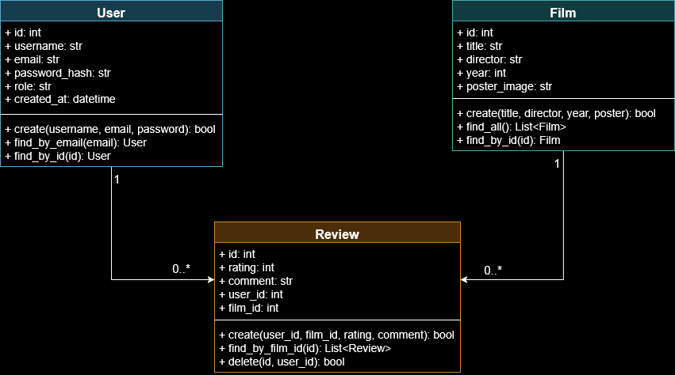

# CineScope - Plataforma de Avaliação de Filmes

Projeto final da disciplina de Programação Orientada a Objetos (2025.2) - UnB (Prof. Lucas Boaventura).

O CineScope é uma aplicação web desenvolvida em Python que permite aos usuários catalogar, avaliar e comentar sobre filmes, aplicando na prática os conceitos de MVC, Persistência de Dados e Autenticação.

---

## Autores
* **Pedro Victor Teixeira Silva - 241041204** - Backend, Banco de Dados & Arquitetura
* **Vitor Eduardo Araújo - 241025720** - Frontend, UI Design & Integração

---

## Funcionalidades Desenvolvidas

### Usuários (User)
* **Autenticação:** Sistema de Cadastro e Login com criptografia de senha (SHA-256).
* **Sessão:** Controle de acesso via Cookies assinados/seguros.
* **Permissões:** Diferenciação entre usuários 'regular' e 'admin'.

### Filmes (Film)
* **Catálogo:** Listagem dinâmica de filmes na página inicial.
* **Detalhes:** Página exclusiva com informações do filme e poster.
* **Admin:** Apenas administradores podem cadastrar novos filmes.

### Avaliações (Review)
* **Interação:** Usuários logados podem dar notas (1-5) e comentar.
* **Relacionamento:** As reviews são vinculadas automaticamente ao Usuário e ao Filme (JOIN).

---

## Diagrama de Classes (UML)

Abaixo está a modelagem do sistema, ilustrando as classes User, Film e Review e seus relacionamentos (1:N).

---

## Estrutura do Projeto

A arquitetura segue o padrão MVC (Model-View-Controller):

epf-python-bottle-CineScope/
├── app.py              # Configuração da Aplicação e Rotas Estáticas
├── main.py             # Arquivo principal para rodar o servidor
├── config.py           # Configurações de ambiente (Debug, Porta)
├── admin_tool.py       # Ferramenta CLI para promover usuários a Admin
├── requirements.txt    # Dependências (Bottle, etc)
├── controllers/        # CONTROLADORES (Gerentes de Rotas)
│   ├── user_controller.py
│   ├── film_controller.py
│   └── review_controller.py
├── models/             # MODELOS (Lógica de Dados e SQL)
│   ├── user.py
│   ├── film.py
│   └── review.py
├── views/              # VISÃO (Templates HTML .tpl)
│   ├── index_home.tpl
│   ├── index_login.tpl
│   ├── film_details.tpl
│   └── ...
├── static/             # Arquivos Públicos
│   ├── css/
│   └── img/
└── data/               # BANCO DE DADOS
    ├── database.py     # Script de criação das tabelas
    └── cinescope.db    # Arquivo do banco SQLite

---

## Como Executar

### 1. Preparar o Ambiente
Crie e ative o ambiente virtual (venv):

# Windows
python -m venv venv
.\venv\Scripts\activate

# Linux/Mac
python3 -m venv venv
source venv/bin/activate

### 2. Instalar Dependências
pip install -r requirements.txt

### 3. Criar o Banco de Dados
Execute o script que gera o arquivo cinescope.db e as tabelas:
python data/database.py

### 4. Rodar o Servidor
python main.py

Acesse no navegador: http://localhost:8080

---

## Como virar Admin
Para testar o cadastro de filmes, você precisa de permissão de administrador.
1. Cadastre-se no site normalmente.
2. Pare o servidor e rode o script de ferramenta:
python admin_tool.py
3. Escolha o ID do seu usuário para promovê-lo.

---

## Licença
Projeto acadêmico baseado no template do professor Lucas Boaventura, modificado para uso de SQLite e arquitetura modular de rotas.